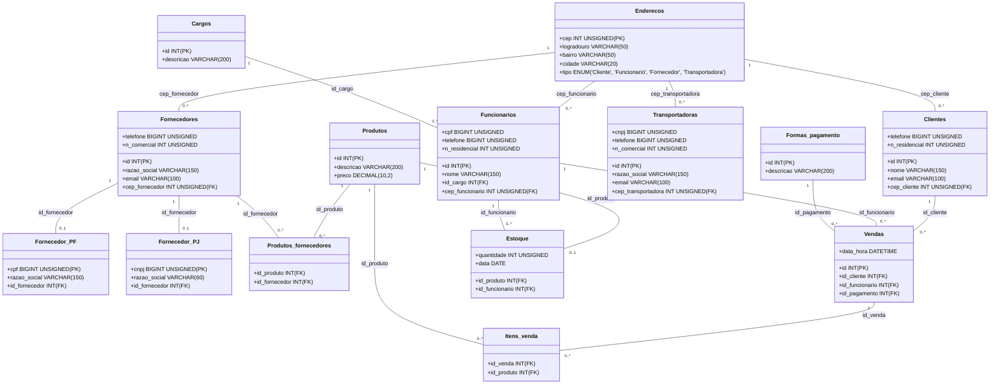

# Avanade Decola 2025 - RESTful API de uma Quitandaria

## Principais Tecnologias
- Java 17: foi utilizada a versão 17 do Java, pois tem compatibilidade com o build do Maven;
- Spring Boot 3 (3.4.3): a versão mais recente LTS do Spring Boot;
- Spring Web
- Spring Data JPA: facilita a integração com bancos de dados SQL;
- Spring Security: para a autenticação e segurança da API;
- OpenAPI (Swagger): criação da documentação da API;
- PostgreSQL
- Railway: facilita o deploy e monitoramento de nossas soluções na nuvem, além de oferecer diversos bancos de dados como serviço e pipelines de CI/CD.

## Modelagem do Banco de Dados

O banco de dados possui as seguintes tabelas:

- **Enderecos**: armazena informações sobre os endereços.
- **Clientes**: contém os dados dos clientes da quitandaria.
- **Cargos**: define os cargos dos funcionários.
- **Funcionarios**: armazena informações dos funcionários da loja.
- **Fornecedores**: lista os fornecedores de produtos.
- **Fornecedor_PF** e **Fornecedor_PJ**: diferenciam fornecedores como Pessoa Física e Pessoa Jurídica.
- **Transportadoras**: contém os dados das transportadoras.
- **Produtos**: lista os produtos vendidos na quitandaria.
- **Produtos_fornecedores**: define quais produtos são de quais fornecedores.
- **Formas_pagamento**: lista as formas de pagamento aceitas.
- **Vendas**: registra as vendas realizadas.
- **Itens_venda**: relaciona as vendas com os produtos comprados.
- **Estoque**: armazena a quantidade de produtos disponíveis.

## Documentação da API (Deploy com Swagger)

https://quitandaria-restful-api-production.up.railway.app/swagger-ui/index.html#/cliente-controller/salvarCliente